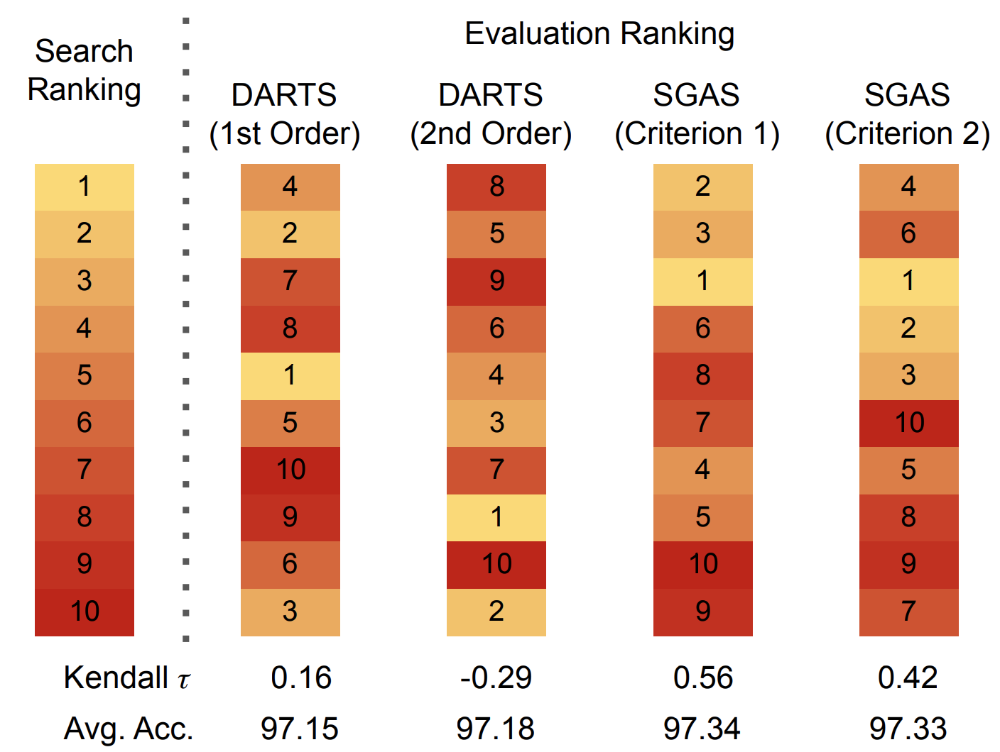
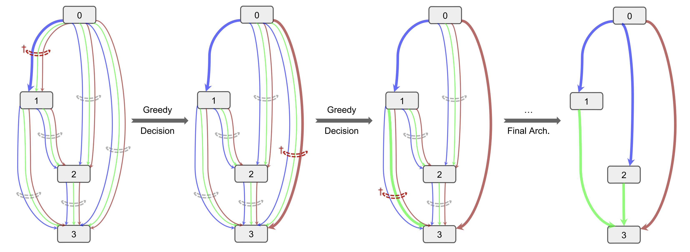

# SGAS: Sequential Greedy Architecture Search
Architectures with a higher validation accuracy during the search phase may perform worse in the evaluation. Aiming to alleviate this common issue, we introduce sequential greedy architecture search (SGAS), an efficient method for neural architecture search. By dividing the search procedure into subproblems, SGAS chooses and prunes candidate operations in a greedy fashion. We apply SGAS to search architectures for Convolutional Neural Networks (CNN) and Graph Convolutional Networks (GCN).

[[Project]](https://www.deepgcns.org/auto/sgas) [[Paper]](https://arxiv.org/abs/1912.00195) [[Slides]](https://docs.google.com/presentation/d/1f2djE-yfjXJjF3G-6HDH7v_NNWDEeapsbGAr7bJKtBY/present?slide=id.g6bb5d0ad3a_2_45) [[Pytorch Code]](https://github.com/lightaime/sgas)
<p align="center">
  
</p>

## Overview
Extensive experiments show that `SGAS` is able to find state-of-the-art architectures for tasks such as image classification, point cloud classification and node classification in protein-protein interaction graphs with minimal computational cost.

<p align="center">
  
</p>

## Requirements
* [Pytorch 1.4.0](https://pytorch.org/)
* [Pytorch Geometric](https://pytorch-geometric.readthedocs.io/en/latest/) (only needed for GCN experiments)

## Conda Environment
In order to setup a conda environment with all neccessary dependencies run,
```
source sgas_env_install.sh
```

## Getting Started
You will find detailed instructions how to use our code for CNN architecture search, in the folder [cnn](cnn/) and GCN architecture search, in the folder [gcn](gcn/). Currently, we provide the following:
* Conda environment
* Search code
* Training code
* Evaluation code
* Several pretrained models
* Visualization code

## Citation
Please cite our paper if you find anything helpful,
```
@inproceedings{li2019sgas,
  title={SGAS: Sequential Greedy Architecture Search},
  author={Li, Guohao and Qian, Guocheng and Delgadillo, Itzel C and M{\"u}ller, Matthias and Thabet, Ali and Ghanem, Bernard},
  booktitle={Proceedings of IEEE Conference on Computer Vision and Pattern Recognition (CVPR)},
  year={2020},
}
```

## License
MIT License

## Acknowledgement
This code is heavily borrowed from [DARTS](https://github.com/quark0/darts). We would also like to thank [P-DARTS](https://github.com/chenxin061/pdarts) for the test code on ImageNet.

## Contact
Further information and details please contact [Guohao Li](https://ghli.org) and [Guocheng Qian](https://www.gcqian.com/).
